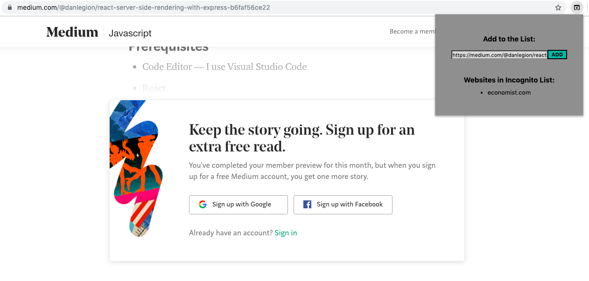
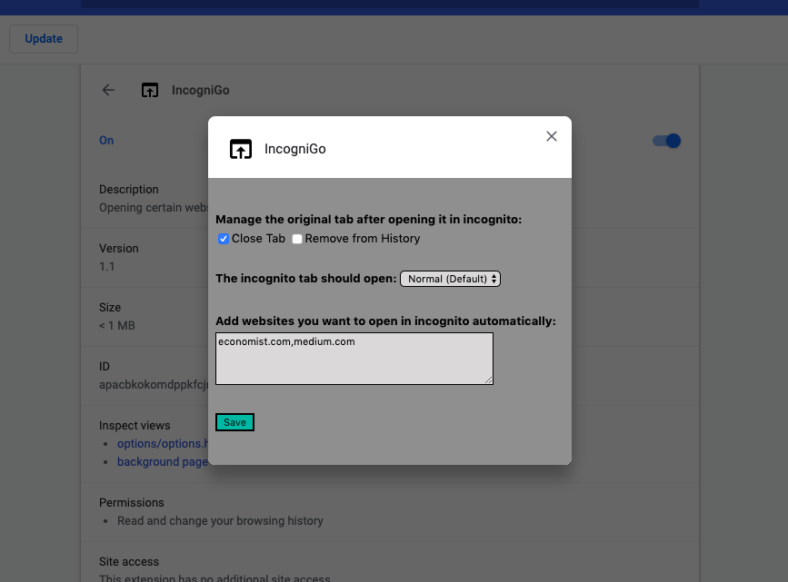

# incogni-go

attempts to solve the pesky problem of article-limit paywalls, while browsing the internet.

--------
## Installation

To install incogni-go, start by downloading or cloning the repo to your machine. Then you can load the folder to your Chrome browser (packed or unpacked) through the [Chrome extensions](chrome://extensions/) page. Be sure to enable the Developer mode from settings!

--------
## Features

You have a popup and options page to choose from, when setting the user-list.

#### Popup

#### Options

--------
## License

This project is licensed under the [MIT license](../LICENSE).
